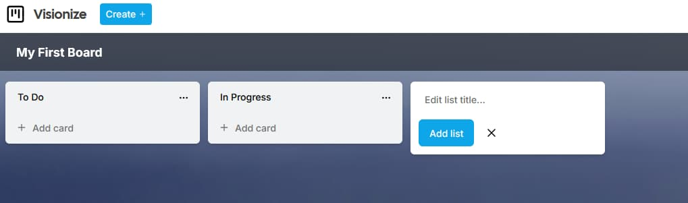

# Visionize

Visualize and realize your vision with **Visionize**, a productivity application that allows you to organize your tasks and projects using boards, lists and cards.

Whether you are using individually or collaborating with a team, you can use this app to set goals, track progress and manage deadlines.

Inspired by [Kanban](https://en.wikipedia.org/wiki/Kanban_(development)), (看板, meaning signboard or billboard in Japanese), a tool used to both visualize and optimize the flow of work. See [kanban section](#kanban) to learn more.

# Description

Visionize is a productivity app for organizing tasks with boards, lists, and cards. Built with Next.js 14, TypeScript, React, TailwindCSS, Prisma ORM, PostgreSQL, Clerk, Stripe, zustand, react-query, and shadcn/ui. Features CRUD, drag-and-drop, audit logs, Zod validation, and freemium capabilities.

Based on the kanban method, this app is a tool to visualize workflow in three steps:

1. To Do
2. In Progress
3. Done

While using only three components:

1. **Boards**, where tasks are organized
2. **Lists**, displays the different stages of a task (To Do, In Progress, Done)
3. **Cards**, which represent tasks, ideas and information

It also has an **audit log**, a record of events and changes, to enhance collaboration.

> Uses **Next.js 14**, with features such as [Server Actions](https://nextjs.org/blog/next-14#server-actions-stable).

# 📸 Preview & Screenshots

## 🏢 Create Organizations

Set up workspaces to manage boards collaboratively.


---

## 🗂️ View Board List

Access all your boards from a centralized dashboard.


---

## 🧱 Create Lists

Build workflow stages like "To Do", "In Progress", and "Done".



---

## 🧳 Create Boards

Create new boards with custom titles and workflows. Each board is visually enhanced with a unique background sourced from the Unsplash API.


---

## 🧩 Manage Boards with Lists & Cards

Customize each board dynamically—edit titles, lists, and cards at any time.


---

## 🖱️ Drag and Drop Interaction

Reorganize cards across lists with smooth drag-and-drop functionality.


---

## 🕵️ Activity Logs

View a complete audit history of all actions taken across boards.


# Technologies

| Technology                  | Purpose                                                                 |
|----------------------------|-------------------------------------------------------------------------|
| **Next.js 14**             | Full-stack React framework for routing, rendering, and API routes       |
| **TypeScript**             | Strongly typed language for safer and scalable development              |
| **React**                  | Component-based UI library powering the frontend                        |
| **TailwindCSS**            | Utility-first CSS framework for rapid UI styling                        |
| **PostgreSQL + Prisma ORM**| Relational database with type-safe query building                       |
| **Clerk**                  | Authentication and user management with support for organizations       |
| **Stripe API**             | Handles freemium billing and secure payment processing                  |
| **zustand**                | Lightweight and scalable state management for React                     |
| **shadcn/ui**              | Prebuilt Radix UI components styled with TailwindCSS                    |
| **@hello-pangea/dnd**      | Drag-and-drop library for intuitive task reordering                     |
| **@tanstack/react-query** | Data fetching and caching for performant UIs                            |
| **Zod**                    | Type-safe schema validation for form inputs and API payloads            |
| **Sonner**                 | Toast notification system for real-time user feedback                   |
| **Lucide-react**           | Icon library for clean and customizable UI elements                     |
| **Unsplash API**           | Dynamically generates board cover images for visual context             |

# Specifications

- User can **create**, **read**, **update** and **delete** boards
- User can **create**, **read**, **update** and **delete** lists
- User can **create**, **read**, **update** and **delete** cards
- Users can view activity history with *audit logs*

# Core Capabilities

- CRUD operations for Boards, Lists, and Cards  
- Real-time drag-and-drop task organization  
- Audit logs for tracking user actions  
- Workspace-level collaboration with Organizations  
- Freemium access control via Stripe (org-based billing, board limits, upgrade flow)

# Prerequisites

- [Node](https://nodejs.org/en/download) version 14 or higher

# Instructions to run locally

**1. Clone this repo (or download zip on GitHub)**

**2. Go to the directory the files are located**

    In the terminal:

    ```powershell
    cd /visionize
    ```

**3. Install dependencies**

  In the terminal:

    ```powershell
    npm run install
    ```

**4. Generate Prisma Client**

  If the `postinstall` script does not run after installing the dependencies, then do the following:

  In the terminal:

    ```powershell
    npx prisma generate
    ```

The command `npx prisma generate` creates the Prisma Client, which is a set of auto-generated functions tailored to your database schema. This client allows you to easily interact with your database in your code. Essentially, it updates the client whenever you make changes to your Prisma schema.

**5. Create an `.env` file**

Create the `.env` file at the base of the project. It should contain the following environment variables:

```sh
NEXT_PUBLIC_CLERK_PUBLISHABLE_KEY=
CLERK_SECRET_KEY=
NEXT_PUBLIC_CLERK_SIGN_IN_URL=/sign-in
NEXT_PUBLIC_CLERK_SIGN_UP_URL=/sign-up
NEXT_PUBLIC_CLERK_AFTER_SIGN_IN_URL=/org-selection
NEXT_PUBLIC_CLERK_AFTER_SIGN_UP_URL=/org-selection

DATABASE_URL=
NEXT_PUBLIC_UNSPLASH_ACCESS_KEY=
STRIPE_API_KEY=
NEXT_PUBLIC_APP_URL=http://localhost:3000
STRIPE_WEBHOOK_SECRET=
```

- To get the keys `NEXT_PUBLIC_CLERK_PUBLISHABLE_KEY`, `CLERK_SECRET_KEY` follow the documentation with [Clerk quick start](https://clerk.com/docs/quickstarts/nextjs).

- To create your local `DATABASE_URL`, install PostgreSQL on your local machine. Follow this guide: [set up a local postgresql database | Prisma](https://www.prisma.io/dataguide/postgresql/setting-up-a-local-postgresql-database)

- For image API generation, create an account with [Unsplash Image API](https://unsplash.com/developers) and follow the [Unsplash documentation - Getting started](https://unsplash.com/documentation#getting-started) to get the `NEXT_PUBLIC_UNSPLASH_ACCESS_KEY`.

- For payment handling, create an account with [Stripe](https://dashboard.stripe.com/) and in the Developers tab get the key for `STRIPE_API_KEY`. 
- While still logged-in the Stripe dashboard, click the Webhooks tab or navigate to `https://dashboard.stripe.com/test/webhooks`. Click on "Test in a local environment" and follow the instructions. 
  - Using the Stripe CLI run the command `stripe login` in the terminal of your choice
  - Forward your events to the webhook with the command: `stripe listen --forward-to localhost:3000/api/webhook`
  - Then you will get the **webhook signing secret** value from the terminal, save this as the value to `STRIPE_WEBHOOK_SECRET` in your environment variables.

With your environment variables all set up, you are not ready to run the app locally.

**6. Run the app locally**

  In the terminal:

    ```powershell
    npm run dev
    ```

  Then with the browser of your choice, navigate to the link: `http://localhost:3000`

**7. Use the app**

  You can now create boards, lists and cards within an organization.

# Kanban

[Kanban](https://en.wikipedia.org/wiki/Kanban_(development)), (看板, meaning signboard or billboard in Japanese), a lean method to manage and improve work across human systems.

Benefits to use:

- Traceability
- Collaboration
- Accessibility

This approach aims to manage work by balancing demands with available capacity, and by improving the handling of system-level bottlenecks.

Work items are visualized to give participants a view of progress and process, from start to finish—usually via a kanban board. Work is pulled as capacity permits, rather than work being pushed into the process when requested.

In knowledge work and in software development, the aim is to provide a visual process management system which aids decision-making about what, when, and how much to produce. The underlying kanban method originated in lean manufacturing, which was inspired by the Toyota Production System.

## Kanban guide

## Audit logging and Kanban

According to the [The Kaban Guide (2020)(by John Colemane and Daniel Vacanti)](https://kanbanguides.org/english/), the Kanban strategy optimizes the flow of value through a process that uses a visual, pull-based system.

"Kanban comprises the following three practices working in tandem:

1. Defining and visualizing a workflow
2. Actively managing items in a workflow
3. Improving a workflow

In their implementation, these Kanban practices are collectively called a Kanban system. Those who participate in the value delivery of a Kanban system are called Kanban system members."
